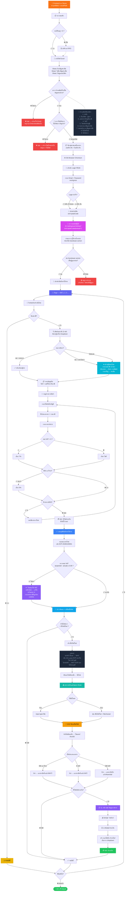

# 🤖 Bot Automation — ขั้นตอนการทำงาน (Flow เส้นตรง)

> สร้างจาก `docs/bot-workflow.md`

---

```mermaid
flowchart TD
    A["🚀 Frontend กด เริ่มบอท<br/>ส่ง profileId + excelPath"] --> B

    B["📋 ตรวจสอบคิว"] --> B1{"งานที่รันอยู่ < 5 ?"}
    B1 -- "✅ ว่าง" --> C
    B1 -- "❌ เต็ม" --> B2["⏳ เข้าคิวรอ FIFO"]
    B2 -.-> C

    C["📁 อ่านไฟล์ Excel"] --> C1["Sheet: มีภาษีมูลค่าเพิ่ม<br/>Sheet: ไม่มีภาษีมูลค่าเพิ่ม<br/>Sheet: ที่อยู่แต่ละบริษัท"]
    C1 --> C2{"ตรวจ 9 คอลัมน์ที่จำเป็น<br/>ข้อมูลครบถ้วน?"}
    C2 -- "❌ ไม่ครบ" --> C3["❌ หยุด — แจ้งแก้ไข Excel<br/>ระบุว่าแถวไหนขาดคอลัมน์อะไร"]
    C2 -- "✅ ครบ" --> C5{"📂 ตรวจไฟล์ต้นทาง<br/>ชื่อไฟล์เก่า มีอยู่จริง?"}
    C5 -- "❌ ไม่ครบ" --> C5ERR["❌ หยุด — แจ้งว่าไฟล์ไหนหายไป<br/>ระบุแถว + ชื่อไฟล์"]
    C5 -- "✅ ครบทุกไฟล์" --> C4["📦 จัดกลุ่มตามเลขที่เอกสาร<br/>เลขเดียวกัน = บิลเดียวกัน"]

    C2 -.- C2NOTE["📌 9 คอลัมน์ที่ต้องมีค่า:<br/>1. ลำดับ<br/>2. ชื่อบริษัท - ผู้ขาย<br/>3. เลขประจำตัวผู้เสียภาษี<br/>4. วันที่<br/>5. โค้ดบันทึกบัญชี<br/>6. ยอดก่อนภาษีมูลค่าเพิ่ม<br/>7. ยอดหลังบวกภาษีมูลค่าเพิ่ม<br/>8. ชื่อไฟล์ใหม่<br/>9. ชื่อไฟล์เก่า"]
    style C2NOTE fill:#1e293b,color:#94a3b8,stroke:#334155,stroke-dasharray:5
    style C5ERR fill:#ef4444,color:#fff,stroke:none

    C4 --> D["🌐 เปิด Browser Chromium"]
    D --> E["🔐 เข้าหน้า Login PEAK"]
    E --> E1["กรอก Email + Password<br/>กดเข้าสู่ระบบ"]
    E1 --> E2{"Login สำเร็จ?"}
    E2 -- "✅ URL มี /home" --> F
    E2 -- "⚠️ URL อื่น" --> F

    F["🏢 เข้าหน้าบริษัท emi=peakCode"] --> F1

    F1["🔑 ตรวจสอบสิทธิ์ผู้ใช้<br/>เข้า /setting/userSetting?emi=peakCode&reload=1"] --> F2["อ่านตาราง ผู้ใช้งานในระบบ<br/>ค้นหาชื่อ Kanokwan somsri"]
    F2 --> F3{"พบ Kanokwan somsri<br/>เป็นผู้ดูแลระบบ?"}
    F3 -- "✅ พบ" --> G["📝 เข้าหน้าบันทึกค่าใช้จ่าย"]
    F3 -- "❌ ไม่พบ" --> F4["❌ หยุดการทำงาน<br/>แจ้งเตือน: ไม่พบสิทธิ์ผู้ดูแล"]

    G --> LOOP["🔁 เริ่มลูป — บิลที่ 1, 2, 3 ..."]
    LOOP --> H["🔄 รีเฟรชหน้าสร้างบิลใหม่"]
    H --> H1{"มีเลขภาษี?"}
    H1 -- "❌ ว่าง" --> SKIP["⚠️ ข้ามบิลนี้"]
    H1 -- "✅ มี" --> I

    I["🔍 พิมพ์เลขภาษี 13 หลัก<br/>ค้นหาผู้ขายใน Dropdown"] --> I1{"ผลการค้นหา?"}
    I1 -- "พบ + สาขาตรง" --> I2["✅ คลิกเลือกผู้ขาย"]
    I1 -- "พบ + สาขาไม่ตรง" --> I3
    I1 -- "ไม่พบเลย" --> I3

    I3["➕ สร้างผู้ติดต่อใหม่<br/>กรอกเลขภาษี 13 ช่อง<br/>เลือกสาขา → ค้นหา กรมพัฒน์<br/>กรอกที่อยู่ → กดเพิ่ม"]

    I2 --> J
    I3 --> J

    J["📋 กรอกข้อมูลบิล<br/>วันที่ + เลขที่ใบกำกับภาษี"] --> K

    K["🔁 วนลูปรายการสินค้า"] --> K1["กรอกโค้ดบันทึกบัญชี"]
    K1 --> K2["ตั้งประเภทราคา = รวมภาษี"]
    K2 --> K3["กรอกราคา/หน่วย"]
    K3 --> K4{"ยอด VAT > 0 ?"}
    K4 -- "✅" --> K4A["เลือก 7%"]
    K4 -- "❌" --> K4B["เลือก ไม่มี"]
    K4A --> K5
    K4B --> K5
    K5{"มีหัก ณ ที่จ่าย?"}
    K5 -- "✅ เช่น 5" --> K5A["เลือก 5%"]
    K5 -- "❌ ว่าง" --> K6
    K5A --> K6
    K6{"มีรายการถัดไป?"}
    K6 -- "✅ มี" --> K6A["กดเพิ่มรายการใหม่"]
    K6A --> K1
    K6 -- "❌ หมด" --> L

    L["💳 คลิก 'ยังไม่ชำระเงิน<br/>ตั้งหนี้ไว้ก่อน'"] --> M

    M["✅ กดอนุมัติบันทึกค่าใช้จ่าย"] --> M1["รอเลขเอกสารใหม่<br/>เช่น EXP-20260100001"]

    M1 --> N{"ตรวจสอบ VAT<br/>|expected - actual| ≤ 0.05 ?"}
    N -- "⚠️ ไม่ตรง" --> N1
    N1["✏️ โหมดแก้ไข VAT<br/>กดตัวเลือก → แก้ไข<br/>หาไอคอน ✏️<br/>กรอกยอดภาษีที่ถูกต้อง<br/>กดบันทึก"] --> FILE_START

    N -- "✅ ตรงกัน" --> FILE_START

    FILE_START["📁 10. คัดลอก + เปลี่ยนชื่อไฟล์"] --> FILE_CHECK{"มี ชื่อไฟล์เก่า<br/>+ ชื่อไฟล์ใหม่ ?"}
    FILE_CHECK -- "❌ ไม่มี" --> DONE_BILL
    FILE_CHECK -- "✅ มี" --> FILE_NAME

    FILE_NAME["สร้างชื่อไฟล์ใหม่"] --> FILE_NAME_NOTE
    FILE_NAME_NOTE["รูปแบบ:<br/>จดVAT+มียอด → WHT dd_mm_yyyy EXP-xxx ชื่อใหม่ VAT.pdf<br/>ไม่จดVAT → WHT EXP-xxx ชื่อใหม่.pdf"]
    FILE_NAME_NOTE --> FILE_COPY["คัดลอกไฟล์ต้นฉบับ → ชื่อใหม่"]

    FILE_COPY --> FILE_UPLOAD["📤 10.5 อัปโหลดไฟล์เข้า PEAK"]
    FILE_UPLOAD --> UPLOAD_METHOD{"วิธีอัปโหลด"}
    UPLOAD_METHOD -- "วิธี 1" --> UP1["input type=file"]
    UPLOAD_METHOD -- "วิธี 2" --> UP2["ปุ่ม เพิ่มไฟล์ใหม่ + filechooser"]
    UP1 --> FILE_MOVE
    UP2 --> FILE_MOVE

    FILE_MOVE["📂 10.6 จัดระเบียบไฟล์"] --> MOVE1["ย้ายไฟล์ต้นฉบับ → โฟลเดอร์ ต้นฉบับ/"]
    MOVE1 --> MOVE2_CHECK{"เช็คประเภทเอกสาร"}
    MOVE2_CHECK -- "มีหัก ณ ที่จ่าย" --> MOVE_WHT["ย้าย → เอกสารบันทึกแล้ว/WHT/"]
    MOVE2_CHECK -- "มี VAT" --> MOVE_VAT["ย้าย → เอกสารบันทึกแล้ว/VAT/"]
    MOVE2_CHECK -- "ไม่มี VAT" --> MOVE_NONE["ย้าย → เอกสารบันทึกแล้ว/NoneVat/"]
    MOVE_WHT --> PAY_CHECK
    MOVE_VAT --> PAY_CHECK
    MOVE_NONE --> PAY_CHECK

    PAY_CHECK{"มีโค้ดตัดชำระเงิน?"}
    PAY_CHECK -- "❌ ไม่มี" --> DONE_BILL
    PAY_CHECK -- "✅ มี" --> PAY1

    PAY1["📋 11. คลิก tab 'ข้อมูลการชำระ'"] --> PAY2["💰 คลิกปุ่ม 'จ่ายชำระ'"]
    PAY2 --> PAY3["⏳ รอ Modal ชำระเงิน"]
    PAY3 --> PAY4["✍️ กรอกโค้ดใน 'ชำระโดย'<br/>เลือกจาก dropdown"]
    PAY4 --> PAY5["💳 คลิก 'ชำระเงิน'"]
    PAY5 --> DONE_BILL

    DONE_BILL["✅ จบบิลนี้"]

    SKIP --> NEXT
    DONE_BILL --> NEXT{"มีบิลถัดไป?"}
    NEXT -- "✅ มี" --> LOOP
    NEXT -- "❌ หมดแล้ว" --> FINISH

    FINISH(["🎉 Job เสร็จสมบูรณ์"])

    %% ── Styles ──
    style A fill:#f97316,color:#fff,stroke:none
    style FINISH fill:#22c55e,color:#fff,stroke:none
    style C3 fill:#ef4444,color:#fff,stroke:none
    style SKIP fill:#eab308,color:#000,stroke:none
    style M fill:#3b82f6,color:#fff,stroke:none
    style N1 fill:#8b5cf6,color:#fff,stroke:none
    style I3 fill:#06b6d4,color:#fff,stroke:none
    style LOOP fill:#6366f1,color:#fff,stroke:none
    style F1 fill:#d946ef,color:#fff,stroke:none
    style F4 fill:#ef4444,color:#fff,stroke:none
    style FILE_START fill:#0ea5e9,color:#fff,stroke:none
    style FILE_UPLOAD fill:#14b8a6,color:#fff,stroke:none
    style FILE_MOVE fill:#f59e0b,color:#000,stroke:none
    style FILE_NAME_NOTE fill:#1e293b,color:#94a3b8,stroke:#334155,stroke-dasharray:5
    style PAY1 fill:#8b5cf6,color:#fff,stroke:none
    style PAY5 fill:#22c55e,color:#fff,stroke:none
```
