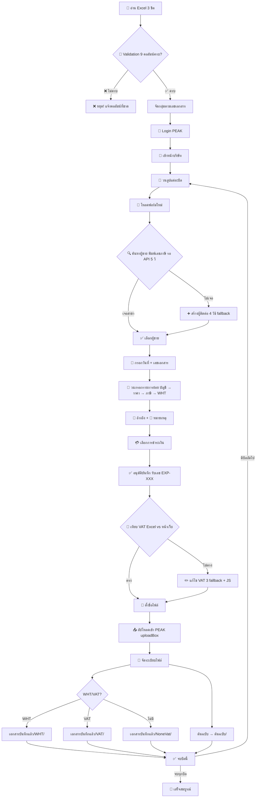

# 🤖 Bot Automation Workflow — คู่มือการทำงานละเอียด

> อ้างอิงจาก `backend/routes/bot-automation.js` — อัพเดท 12/03/2026

---

## Phase 0: เตรียมข้อมูล (Job Queue & Excel)

### 0.1 สร้าง Job

| Step | รายละเอียด | Log |
|------|-----------|-----|
| 0.1.1 | Frontend ส่ง `POST /start` พร้อม `profileId` + `excelPath` | |
| 0.1.2 | ดึง Profile จาก DB (`bot_profiles`) → สร้าง Job object | |
| 0.1.3 | Job เก็บ: `peakCode`, `vatStatus`, `excelPath`, `username`, `software` | |
| 0.1.4 | เช็คจำนวน Concurrent → ทำทันที หรือ เข้าคิว | `🎯 เริ่มทำงานทันที` |

### 0.2 อ่าน Excel

| Step | รายละเอียด | Log |
|------|-----------|-----|
| 0.2.1 | อ่านไฟล์ Excel จาก `excelPath` | `📁 กำลังอ่านออเดอร์จากไฟล์ Excel...` |
| 0.2.2 | ดึง 3 ชีต: `มีภาษีมูลค่าเพิ่ม` / `ไม่มีภาษีมูลค่าเพิ่ม` / `ที่อยู่แต่ละบริษัท` | |
| 0.2.3 | รวมรายการจาก 2 ชีตแรก → `allTransactions` | |

### 0.3 🚫 Validation Gate (ก่อน Login)

> **⚠️ ถ้ามีรายการใดข้อมูลไม่ครบ → ระบบหยุดทั้งหมด ไม่เข้า Login**

**คอลัมน์ที่ต้องมีค่าทุกรายการ:**

| # | คอลัมน์ | ตัวอย่างค่า |
|---|---------|------------|
| 1 | `ลำดับ` | 1, 2, 3... |
| 2 | `ชื่อบริษัท - ผู้ขาย` | บริษัท ABC จำกัด |
| 3 | `เลขประจำตัวผู้เสียภาษี` | 0107567000414 |
| 4 | `วันที่` | 05/01/2026 |
| 5 | `โค้ดบันทึกบัญชี` | 51101 |
| 6 | `ยอดก่อนภาษีมูลค่าเพิ่ม` | 1,000.00 |
| 7 | `ยอดหลังบวกภาษีมูลค่าเพิ่ม` | 1,070.00 |
| 8 | `ชื่อไฟล์ใหม่` | ทดสอบการตั้งชื่อ |
| 9 | `ชื่อไฟล์เก่า` | WHT5% - ชื่อเดิม.pdf |

| ผลลัพธ์ | Action | Log |
|---------|--------|-----|
| ✅ ครบทุกรายการ | ดำเนินการต่อ | `✅ อ่านไฟล์แล้วพบ X รายการ` |
| ❌ มีรายการไม่ครบ | **หยุดทันที** สถานะ = `error` | `❌ พบ N รายการที่ข้อมูลไม่ครบ` |

> รองรับชื่อคอลัมน์ที่มี whitespace / ขึ้นบรรทัดใหม่ต่างกันใน header

### 0.4 จัดกลุ่มรายการ

- จัดกลุ่มตาม **`เลขที่เอกสาร`** → 1 กลุ่ม = 1 บิล (อาจมีหลาย row ถ้ามีหลายรายการย่อย)

---

## Phase 1: เปิดเบราว์เซอร์ & Login

| Step | รายละเอียด | Log |
|------|-----------|-----|
| 1.1 | เปิด Shared Chromium Browser (headless: false) | `🌐 กำลังเตรียมเบราว์เซอร์...` |
| 1.2 | สร้าง Context + Page ใหม่ | |
| 1.3 | ไปที่ `secure.peakaccount.com` | `🔗 กำลังเปิดหน้าล็อกอิน PEAK...` |
| 1.4 | กรอก Email จาก `job.username` | `📧 กรอกอีเมล` |
| 1.5 | กรอก Password | `🔒 กรอกรหัสผ่าน` |
| 1.6 | คลิก **"เข้าสู่ระบบ PEAK"** → รอ redirect | `✅ Login สำเร็จ!` |

---

## Phase 2: เข้าหน้าบริษัท

| Step | รายละเอียด | Log |
|------|-----------|-----|
| 2.1 | ไปที่ `/home?emi={peakCode}` | `🏢 เข้าสู่หน้าหลักของบริษัท` |
| 2.2 | ไปที่ `/expense/purchaseInventory?emi={peakCode}` | `📝 หน้า "บันทึกบัญชีค่าใช้จ่าย"` |

---

## Phase 3: วนลูปแต่ละบิล (Per Document Group)

### 3A. เตรียมหน้าฟอร์มใหม่

| Step | รายละเอียด | Log |
|------|-----------|-----|
| 3A.1 | โหลดหน้า `/expense/invoiceCreate` | `🔄 โหลดหน้าบันทึกค่าใช้จ่าย` |
| 3A.2 | ตรวจจับ Page ถูกปิดจากภายนอก → Recovery mode | |

### 3B. ค้นหา/จัดการผู้ขาย (Vendor)

| Step | รายละเอียด | Log |
|------|-----------|-----|
| 3B.1 | คลิกช่อง Dropdown ผู้ขาย | `🖱️ คลิกตัวเลือกผู้ขาย...` |
| 3B.2 | พิมพ์ **เลขภาษี 13 หลัก** จาก Excel | `⌨️ กำลังพิมพ์เลขภาษี: XXX` |
| 3B.3 | **รอ API 5 วิ** ให้ตัวเลือกโหลด + **delay 1.5 วิ** ให้ Vue render | `⏳ รอดึงข้อมูลรายชื่อผู้ขาย` |
| 3B.4 | นับรายการใน Dropdown (ข้ามหัวข้อกลุ่ม "รายการที่ใช้บ่อย", "ทั้งหมด") | `📊 พบ N รายการ` |
| 3B.5 | เทียบ **สาขา** กับ Excel → หาสาขาที่ตรงกัน | `📋 วิเคราะห์หาสาขา` |

**เงื่อนไขสำนักงานใหญ่ (HQ):**
- ค่า Excel = `00000`, `สำนักงานใหญ่`, `0000`, หรือ **ว่าง** → ถือว่าเป็น HQ เสมอ
- Dropdown: option ที่ **ไม่มี** `(XXXXX)` ท้ายชื่อ (ไม่นับ 00000) = สำนักงานใหญ่
- Option ที่มีเลขสาขาย่อย (ไม่ใช่ 00000) จะ **ไม่ตรง** กับ HQ

| ผลลัพธ์ | Action | Log |
|---------|--------|-----|
| ✅ เจอสาขาตรง | คลิกเลือก | `✅ พบสาขาที่ตรงกัน` |
| ❌ ไม่เจอ | คลิก "+ เพิ่มผู้ติดต่อ" | `⚠️ ต้องเพิ่มผู้ติดต่อใหม่` |

**การคลิก "+ เพิ่มผู้ติดต่อ" (4 วิธี fallback):**

| วิธี | Selector |
|------|----------|
| 1 | `.multiselect__option` filter text "เพิ่มผู้ติดต่อ" |
| 2 | `getByText("+ เพิ่มผู้ติดต่อ")` |
| 3 | XPath `//span[contains(text(),'เพิ่มผู้ติดต่อ')]` |
| 4 | **JS `dispatchEvent(new MouseEvent('click'))`** ← แก้ปัญหา Vue ไม่จับ event |

### 3B-Modal. สร้างผู้ติดต่อใหม่ (ถ้าต้องสร้าง)

> Modal detection: รอ `input.inputId` (ช่องเลขภาษี 13 หลัก) — มีเฉพาะใน Modal
> ถ้าไม่โผล่ใน 15 วิ → Retry: ปิด Dropdown → เปิดใหม่ → คลิกอีกครั้ง

| Step | รายละเอียด | Log |
|------|-----------|-----|
| M.1 | รอ Modal โหลด → กรอกเลขภาษี 13 หลัก (แยก 13 กล่อง) | `✍️ พิมพ์เลขภาษี 13 หลัก` |
| M.2 | เลือกสาขา: HQ → คลิก "สำนักงานใหญ่" / สาขา → กรอก 5 หลัก | `🏢 / 🏬 เลือกสาขา` |
| M.3 | กด "ค้นหา" (ดึงข้อมูลจากกรมพัฒน์ฯ) | `🔍 กดปุ่ม "ค้นหา"` |
| M.4 | ตรวจสอบ/กรอกที่อยู่ → กด "เพิ่ม" | `💾 บันทึกผู้ติดต่อใหม่` |

### 3C. กรอกข้อมูลหลักของบิล

| Step | คอลัมน์ Excel | Element | Log |
|------|-------------|---------|-----|
| 3C.1 | `วันที่` | `input[name="วันที่ออก"]` | `📅 กรอกวันที่ออก: DD/MM/YYYY` |
| 3C.2 | `วันครบกำหนดชำระ` *(ถ้ามี)* | `input[name="วันที่ครบกำหนด"]` | `📅 กรอกวันที่ครบกำหนด` |
| 3C.3 | `เลขที่เอกสาร` | `input[placeholder="ระบุเลขที่ใบกำกับภาษี"]` | `📝 กรอกเลขที่ใบกำกับภาษี` |

> รองรับ format: Excel serial number, `DD/MM/YYYY`, `YYYY-MM-DD` → แปลงอัตโนมัติ

### 3D. วนลูปกรอกรายการย่อย (Per Line Item)

| Step | รายละเอียด | Log |
|------|-----------|-----|
| 3D.1 | *(รายการที่ 2+)* กดปุ่ม **"เพิ่มรายการใหม่"** | `➕ เพิ่มรายการใหม่` |
| 3D.2 | `โค้ดบันทึกบัญชี` → พิมพ์ในช่อง Dropdown → เลือก | `📦 ค้นหาโค้ดบันทึกบัญชี: XXXXX` |
| 3D.3 | *(รายการแรก)* เปลี่ยน **ประเภทราคา** = `"รวมภาษี"` | `⚙️ ตั้งค่าประเภทราคา` |
| 3D.4 | `ยอดหลังบวกภาษีมูลค่าเพิ่ม` → กรอก **ราคา/หน่วย** | `💰 กรอกราคา/หน่วย: X,XXX.XX` |
| 3D.5 | เช็ค `ยอดภาษีมูลค่าเพิ่ม` → มียอด = เลือก `7%` / ไม่มี = `ไม่มี` | `⚙️ ระบุภาษี: 7%` |
| 3D.6 | เช็ค `เปอร์เซ็นต์หัก ณ ที่จ่าย` → เลือก WHT `X%` | `📝 ระบุหัก ณ ที่จ่าย: X%` |

### 3E. กรอกข้อมูลเสริม (หลังจบลูปรายการ)

| Step | คอลัมน์ Excel | Element | Log |
|------|-------------|---------|-----|
| 3E.1 | `อ้างอิง` *(ถ้ามี)* | `input[placeholder="ระบุเอกสารอ้างอิง ถ้ามี"]` | `📎 กรอกเอกสารอ้างอิง` |
| 3E.2 | `หมายเหตุ` *(ถ้ามี)* | `textarea#หมายเหตุสำหรับผู้ขาย` | `📝 กรอกหมายเหตุ` |

> หมายเหตุ: กด "ย่อ/ขยาย" กางส่วนนี้ก่อนถ้าถูกซ่อน

### 3F. การชำระเงิน

| Step | รายละเอียด | Log |
|------|-----------|-----|
| 3F.1 | เลือกรูปแบบ **"ขั้นสูง"** | `⚙️ เลือกรูปแบบชำระเงิน` |

| เงื่อนไขโค้ดชำระ | Action | Log |
|------------------|--------|-----|
| **ว่าง** | คลิก `"ยังไม่ชำระเงิน (ตั้งหนี้ไว้ก่อน)"` | `💳 โค้ดว่างเปล่า` |
| **ตัวเลข** | ติ๊ก `"ค่าธรรมเนียม"` → ค้นหารหัสบัญชี | `💳 โค้ดเป็นตัวเลข` |
| **ตัวอักษร** | กรอกช่อง `"ช่องทางการเงิน"` | `💳 ระบุช่องทางการเงิน` |

### 3G. บันทึก & ตรวจสอบ VAT

| Step | รายละเอียด | Log |
|------|-----------|-----|
| 3G.1 | คลิก **"อนุมัติบันทึกค่าใช้จ่าย"** | `✅ กดปุ่มอนุมัติ` |
| 3G.2 | รอ redirect → ดึง **เลขที่เอกสารใหม่** จาก `span` (เช่น `#EXP-20260100001`) | `🎉 ได้รับเลข: EXP-XXX` |
| 3G.3 | รวมยอด VAT จากทุก row ใน Excel → เทียบกับยอดบนหน้าเว็บ | |
| 3G.3a | — ต่างกัน ≤ 0.05 → ✅ ตรง | `✅ ยอดภาษีตรงกัน` |
| 3G.3b | — ต่างกัน > 0.05 → ❌ → เข้าโหมดแก้ไข (3H) | `⚠️ ยอดภาษีไม่ตรง!` |

### 3H. แก้ไขยอดภาษี (ถ้าไม่ตรง)

| Step | รายละเอียด | Log |
|------|-----------|-----|
| 3H.1 | คลิก **"ตัวเลือก"** (3 fallback selectors) | `🔄 เข้าโหมดแก้ไข` |
| 3H.2 | รอเมนูกาง **1 วินาที** | |
| 3H.3 | คลิก **"แก้ไข"** (3 selectors + JS `dispatchEvent` fallback) | |
| 3H.4 | รอหน้าโหลด → เลื่อนลงหาไอคอน `fa-pen` → คลิก | `กดไอคอนแก้ไขภาษี` |
| 3H.5 | กรอกยอดภาษีจาก Excel ลง `input[placeholder="0.00"]` | `✅ แก้ไขยอดภาษี: XX.XX` |
| 3H.6 | คลิกพื้นที่ว่าง → รอ Vue อัปเดต | |
| 3H.7 | คลิก `"ยังไม่ชำระเงิน (ตั้งหนี้ไว้ก่อน)"` *(ถ้ามี)* | |
| 3H.8 | กด **"บันทึก"** → รอ 10 วิ | `✅ กดปุ่ม 'บันทึก'` |

### 3I. เปลี่ยนชื่อไฟล์ + อัปโหลด + จัดระเบียบ

#### 3I.1 ตั้งชื่อไฟล์ใหม่

| Step | รายละเอียด | Log |
|------|-----------|-----|
| 3I.1.1 | อ่าน `ชื่อไฟล์เก่า` + `ชื่อไฟล์ใหม่` จาก Excel | |
| 3I.1.2 | ค้นหาไฟล์ต้นทางในโฟลเดอร์เดียวกับ Excel | |
| 3I.1.3 | เช็ค WHT จาก Excel (ทุก row ในบิล) | |
| 3I.1.4 | กำหนดชื่อตาม logic → คัดลอกไฟล์ | `📁 เปลี่ยนชื่อไฟล์สำเร็จ` |

**ตาราง Logic ตั้งชื่อไฟล์:**

| มี WHT | จดทะเบียนภาษี | มียอด VAT | ชื่อไฟล์ |
|--------|--------------|-----------|---------|
| ✅ | ✅ | ✅ | `WHT dd_mm_yyyy EXP-XXX ชื่อใหม่ VAT.ext` |
| ✅ | ❌ หรือ ไม่มี VAT | — | `WHT EXP-XXX ชื่อใหม่.ext` |
| ❌ | ✅ | ✅ | `dd_mm_yyyy EXP-XXX ชื่อใหม่ VAT.ext` |
| ❌ | ❌ หรือ ไม่มี VAT | — | `EXP-XXX ชื่อใหม่.ext` |

- `dd_mm_yyyy` = วันที่จาก Excel คอลัมน์ `วันที่`
- `EXP-XXX` = เลขเอกสารที่ได้จาก PEAK (Step 3G.2)
- `ชื่อใหม่` = คอลัมน์ `ชื่อไฟล์ใหม่`

#### 3I.2 อัปโหลดเข้า PEAK

| Step | รายละเอียด | Log |
|------|-----------|-----|
| 3I.2.1 | เลื่อนหน้าไปหา `.uploadBox` | `📤 กำลังอัปโหลดไฟล์...` |
| 3I.2.2 | **วิธี 1:** หา `input[type="file"]` → `setInputFiles()` | |
| 3I.2.3 | **วิธี 2:** คลิก "เพิ่มไฟล์ใหม่" → จับ `filechooser` event | |
| 3I.2.4 | รอ PEAK ประมวลผล 2 วิ | `✅ อัปโหลดสำเร็จ` |

#### 3I.3 จัดระเบียบโฟลเดอร์

| Step | รายละเอียด | Log |
|------|-----------|-----|
| 3I.3.1 | ย้ายไฟล์ **ต้นฉบับ** → `ต้นฉบับ/` | `📁 ย้ายต้นฉบับ` |
| 3I.3.2 | เช็ค WHT/VAT → เลือกโฟลเดอร์ย่อย | |
| 3I.3.3 | ย้ายไฟล์ **ชื่อใหม่** → `เอกสารบันทึกแล้ว/{subFolder}/` | `✅ จัดระเบียบเสร็จ` |

| เงื่อนไข Excel | โฟลเดอร์ย่อย |
|----------------|-------------|
| มี `เปอร์เซ็นต์หัก ณ ที่จ่าย` > 0 | `WHT/` |
| ไม่มี WHT + มี `ยอดภาษีมูลค่าเพิ่ม` > 0 | `VAT/` |
| ไม่มีทั้ง WHT + VAT | `NoneVat/` |

---

## Phase 4: จบงาน

| Step | รายละเอียด | Log |
|------|-----------|-----|
| 4.1 | วนจบทุกบิล → รอ 10 วินาที | `📋 รอคำสั่งถัดไป...` |
| 4.2 | เปลี่ยนสถานะ = `finished` → ปิด Browser Context | `🎉 เสร็จสมบูรณ์` |

---

## Error Handling

| สถานการณ์ | การจัดการ |
|-----------|----------|
| Excel ข้อมูลไม่ครบ | **หยุดก่อน Login** → แจ้งคอลัมน์ที่ขาด |
| โหลดหน้าไม่ขึ้น | ข้ามบิลถัดไป |
| Page ถูกปิดจากภายนอก | สร้าง Page ใหม่ (Recovery) |
| เกิด Error ในบิล | Log + แคปหน้าจอ → ข้ามไปบิลถัดไป |
| หา Element ไม่เจอ | Multi-selector fallback + JS dispatchEvent |
| ไม่พบไฟล์ต้นทาง | Log warning → ข้ามการจัดไฟล์ |
| Modal ไม่โผล่ | Retry: ปิด Dropdown → เปิดใหม่ → คลิกอีกครั้ง |

---

## โครงสร้างโฟลเดอร์ที่ระบบสร้างอัตโนมัติ

```
📁 โฟลเดอร์ Excel (ต้นทาง)
├── 📄 ข้อมูล.xlsx
├── 📄 WHT5% - ชื่อเดิม.pdf        ← ไฟล์ PDF ต้นฉบับ
│
├── 📁 ต้นฉบับ/                     ← ย้ายไฟล์เดิมมาเก็บ
│   └── WHT5% - ชื่อเดิม.pdf
│
└── 📁 เอกสารบันทึกแล้ว/
    ├── 📁 WHT/                     ← มี % หัก ณ ที่จ่าย
    │   └── WHT 05_01_2026 EXP-XXX ชื่อใหม่ VAT.pdf
    ├── 📁 VAT/                     ← ไม่มี WHT แต่มี VAT
    │   └── 05_01_2026 EXP-XXX ชื่อใหม่ VAT.pdf
    └── 📁 NoneVat/                 ← ไม่มีทั้ง WHT + VAT
        └── EXP-XXX ชื่อใหม่.pdf
```

---

## Flow Diagram


