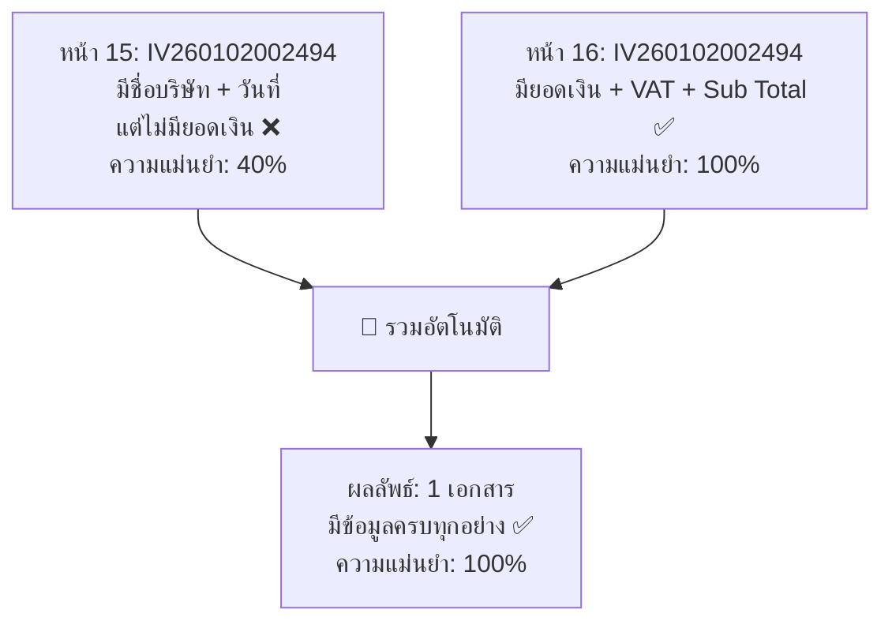

# 📖 ระบบอ่านไฟล์ PDF — หลักการทำงาน

> อธิบายแบบเข้าใจง่าย ไม่ต้องมีพื้นฐานเขียนโปรแกรม

---

## ภาพรวม

ระบบนี้ทำหน้าที่ **อ่านไฟล์ PDF ใบกำกับภาษี แล้วดึงข้อมูลสำคัญออกมาให้อัตโนมัติ** เช่น เลขที่เอกสาร วันที่ ยอดเงิน VAT เป็นต้น — ทำให้ผู้ใช้ไม่ต้องพิมพ์ข้อมูลเองทีละตัว

---

## ขั้นตอนที่ 1: เลือกไฟล์ PDF

ผู้ใช้สามารถ **คลิกเลือกไฟล์** หรือ **ลากไฟล์มาวาง** บนหน้าเว็บ

- รองรับ **หลายไฟล์พร้อมกัน** (เช่น เลือก 5 ไฟล์ PDF ทีเดียว)
- รับเฉพาะไฟล์ `.pdf` เท่านั้น
- ระบบจะจำตำแหน่งที่เก็บไฟล์ต้นฉบับไว้ด้วย (สำหรับบันทึกกลับในอนาคต)

---

## ขั้นตอนที่ 2: อ่านข้อความจาก PDF

PDF ไม่ได้เก็บข้อความเป็นบรรทัดเหมือนที่เราเห็น — จริงๆ แล้วเก็บเป็น **ข้อความชิ้นเล็กๆ กระจายอยู่ตามตำแหน่งต่างๆ** ในหน้า

ระบบจะ:

1. เปิดไฟล์ PDF ขึ้นมา
2. วนอ่านทีละหน้า
3. ดึงข้อความชิ้นเล็กๆ ออกมา
4. **เรียงลำดับตามตำแหน่ง** แล้วประกอบกลับเป็นข้อความที่อ่านรู้เรื่อง

> 💡 เปรียบเทียบ: เหมือนเอาจิ๊กซอว์ตัวอักษรมาต่อกันเป็นประโยค

---

## ขั้นตอนที่ 3: ดึงข้อมูลสำคัญจากข้อความ

เมื่อได้ข้อความจาก PDF แล้ว ระบบจะ **ค้นหาข้อมูลที่ต้องการ** โดยใช้ "รูปแบบคำ" (Pattern Matching)

ระบบจะหา **11 ข้อมูลหลัก:**

| ข้อมูลที่ดึง           | ตัวอย่าง                     | วิธีหา                                              |
| ---------------------- | ---------------------------- | --------------------------------------------------- |
| เลขที่เอกสาร           | IV260102002494               | หาคำว่า "เลขที่ใบกำกับภาษี" แล้วเอาค่าที่ตามมา      |
| เลขที่คำสั่งซื้อ       | 2601020RKKOYAC               | หาคำว่า "เลขที่คำสั่งซื้อ" / "Order No."            |
| วันที่                 | 02/01/2026                   | หาคำว่า "วันที่" ตามด้วยรูปแบบวัน/เดือน/ปี          |
| ยอดก่อน VAT            | 257.01                       | หาคำว่า "Pre-VAT" / "มูลค่าก่อนภาษี"                |
| VAT 7%                 | 17.99                        | หาคำว่า "ภาษีมูลค่าเพิ่ม 7%" แล้วจับตัวเลขข้างหลัง  |
| ยอดรวมทั้งสิ้น         | 275.00                       | หาคำว่า "Grand Total" / "จำนวนเงินรวมทั้งสิ้น"      |
| Sub Total              | 306.00                       | หาคำว่า "Sub Total"                                 |
| ส่วนลด                 | 31.00                        | หาคำว่า "ส่วนลด" / "Discount"                       |
| ผู้ออกเอกสาร           | บริษัท เอ.เค.เอฟ.กรุ๊ป จำกัด | หาชื่อที่ขึ้นต้นด้วย "บริษัท" และลงท้ายด้วย "จำกัด" |
| เลขประจำตัวผู้เสียภาษี | 0125568022576                | หาเลข 13 หลัก                                       |
| ชื่อลูกค้า             | -                            | หาคำว่า "ลูกค้า / Customer"                         |

> ⚠️ ระบบใช้วิธี "จับ pattern ของคำ" — ไม่ใช่ AI อ่าน
> ดังนั้นถ้ารูปแบบเอกสารแตกต่างจากที่ตั้งไว้มาก อาจดึงข้อมูลไม่ได้

---

## ขั้นตอนที่ 4: คำนวณ "ความแม่นยำ" (Confidence Score)

ระบบจะตรวจว่าหาข้อมูลได้ครบหรือไม่ จาก **5 ฟิลด์สำคัญ:**

1. เลขที่เอกสาร
2. วันที่
3. ยอดก่อน VAT
4. VAT
5. ยอดรวม

| หาได้ | ความแม่นยำ | สถานะ                 |
| ----- | ---------- | --------------------- |
| 5/5   | 🟢 100%    | แสดงแบบอ่านอย่างเดียว |
| 4/5   | 🟡 80%     | แก้ไขได้ + Warning    |
| 3/5   | 🟡 60%     | แก้ไขได้ + Warning    |
| 2/5   | 🔴 40%     | แก้ไขได้ + Warning    |

---

## ขั้นตอนที่ 5: รวมเอกสารหลายหน้าที่เป็นชุดเดียวกัน

บางใบกำกับภาษีมีรายการเยอะ ทำให้ **1 เอกสาร ยาว 2-3 หน้า**

ระบบจะตรวจจับโดยดูว่า **หน้าไหนมีเลขที่เอกสารเดียวกัน** แล้วรวมข้อมูลเข้าด้วยกัน:

**หลักการรวม:**

- **ข้อมูลทั่วไป** (ชื่อ, วันที่, เลขเอกสาร) → ใช้ข้อมูลจาก **หน้าแรก** เพราะมักเขียนไว้หน้าปก
- **ยอดเงิน** (VAT, Total, ส่วนลด) → ใช้ข้อมูลจาก **หน้าสุดท้าย** เพราะมักเป็นหน้าสรุปยอด

---

## ขั้นตอนที่ 6: แสดงผลและให้แก้ไข

ระบบจะแสดงข้อมูลที่ดึงได้แบบ "การ์ด" แต่ละใบ:

- 🟢 **ความแม่นยำ 100%** → แสดงข้อมูลอ่านอย่างเดียว
- 🟡 **ความแม่นยำต่ำกว่า 100%** → แสดง Warning + ให้ผู้ใช้พิมพ์แก้ไขข้อมูลที่ขาดได้
- 🔵 **เอกสารที่รวมหลายหน้า** → แสดง badge "📁 รวม 2 หน้า" ให้ผู้ใช้รู้

> 💡 ข้อมูลที่ผู้ใช้แก้ไขจะถูกเก็บแยกออกจากข้อมูลที่ระบบอ่านได้
> ดังนั้นถ้ากด "รีเซ็ต" ข้อมูลจะกลับเป็นค่าที่ระบบอ่านได้เดิม

---

## สรุป: ทำไมต้องทำแบบนี้?

| ปัญหาเดิม                                   | วิธีแก้                                |
| ------------------------------------------- | -------------------------------------- |
| พิมพ์ข้อมูลจากใบกำกับภาษีทีละตัว เสียเวลา   | ระบบอ่านอัตโนมัติ ลดเวลา 80-90%        |
| ใบกำกับภาษีมีหลายรูปแบบ regex ตัวเดียวไม่พอ | ใช้ regex หลายชุด fallback กัน         |
| เอกสาร 1 ชุด แบ่งเป็น 2 หน้า ข้อมูลไม่ครบ   | รวมหน้าที่มีเลขเอกสารเดียวกันอัตโนมัติ |
| ระบบอ่านผิด ไม่มีทางแก้                     | ให้ผู้ใช้แก้ไขได้เมื่อความแม่นยำต่ำ    |
| ต้องเปิดไฟล์ทีละตัว                         | เลือกหลายไฟล์พร้อมกัน ประมวลผลรวม      |
